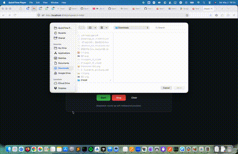

# Demo

# Stopwatch | EN

Use what you’ve learned about prompt engineering to create a stopwatch and countdown.

Reference: https://www.online-stopwatch.com/ (see res/stopwatch.png for design reference)

Do it using the seed index.html + script.js

Use a chatbot, like ChatGPT or Gemini, not a code assistant in an IDE like Copilot.

Tip: if it allows image analysis, you can upload it to easily obtain a design similar to the reference.

To submit the exercise, make a pull request that includes not only the generated code but also, crucially, the prompt used in the file prompts.md. Also, add the prompt in the comment.

To submit, make a pull request that includes a folder copied from the template, with the name stopwatch-initials (e.g., stopwatch-ARM). It should include not only the generated code but also, crucially, the prompt used and the chatbot used in prompts.md. If you’ve used more than one prompt until reaching a suitable solution, add them all in order. Also, include the final prompt in the pull request comment.

Good luck!

### stopwatch-NAR — What’s built & how to run

This repo includes a complete solution under **`stopwatch-NAR/`**:

| File | Role |
|------|------|
| `index.html` | Semantic layout (mode toggle, `<time>` display, countdown inputs, controls), **internal CSS** (dark theme, flex layout, monospace display, flashing state when countdown hits zero). |
| `script.js` | **Vanilla JS** only: stopwatch up to `HH:MM:SS:mmm`, countdown from H/M/S inputs, **Start ↔ Pause**, **Stop** (pause without reset), **Clear** (reset). Timing uses **`requestAnimationFrame` + `performance.now()`** so the display follows real elapsed time. |

**Run locally**

1. `cd stopwatch-NAR`
2. `python3 -m http.server 8080` (or any free port)
3. Open **http://localhost:8080/** in a browser.

You can also open `index.html` directly if the browser loads `script.js` from the same folder (some environments restrict `file://`; the small server above avoids that).

# Stopwatch | ES

Utiliza lo aprendido sobre prompt engineering para crear un **cronómetro y cuenta atrás**. 

Referencia: [https://www.online-stopwatch.com/](https://www.online-stopwatch.com/) (ver res/stopwatch.png, referencia de diseño)

Hazlo apoyado en el seed `index.html` + `script.js`

Utiliza un chatbot, como ChatGPT o Gemini, no un asistente de código en IDE como Copilot.

Tip: si permite el análisis de imágenes, puedes subirla para obtener fácilmente un diseño similar al de referencia.

Para entregar el ejercicio, haz un pull request que incluya no solo el código generado, sino también, fundamental, el prompt utilizado en el fichero prompts.md. Añade además el prompt en el comentario.

Para entregar, haz una pull request que incluya una carpeta copiada de template, con el nombre `stopwatch-iniciales` (ejemplo `stopwatch-ARM`). Debe incluir no solo el código generado, sino también, fundamental, **el prompt utilizado y el chatbot utilizado** en `prompts.md`. Si has usado más de un prompt hasta llegar a una solución adecuada, añade todos en orden. Añade además el prompt final en el comentario del pull request.

¡Éxitos!

### stopwatch-NAR — Qué incluye y cómo ejecutarlo

En este repositorio hay una solución lista en **`stopwatch-NAR/`**:

| Archivo | Función |
|---------|---------|
| `index.html` | Estructura semántica (selector de modo, `<time>` como display, campos de cuenta atrás, botones), **CSS embebido** (tema oscuro, flex, tipografía monoespaciada, parpadeo al llegar a cero). |
| `script.js` | **Solo JavaScript vanilla**: cronómetro `HH:MM:SS:mmm`, cuenta atrás desde horas/minutos/segundos, **Inicio ↔ Pausa**, **Detener** (pausa sin borrar), **Limpiar** (reinicio). El tiempo se basa en **`requestAnimationFrame` + `performance.now()`** para reflejar el transcurrido real. |

**Cómo ejecutarlo**

1. `cd stopwatch-NAR`
2. `python3 -m http.server 8080` (u otro puerto libre)
3. Abre **http://localhost:8080/** en el navegador.

También puedes abrir `index.html` directamente si el navegador carga `script.js` desde la misma carpeta (a veces `file://` limita recursos; el servidor anterior evita ese problema).

